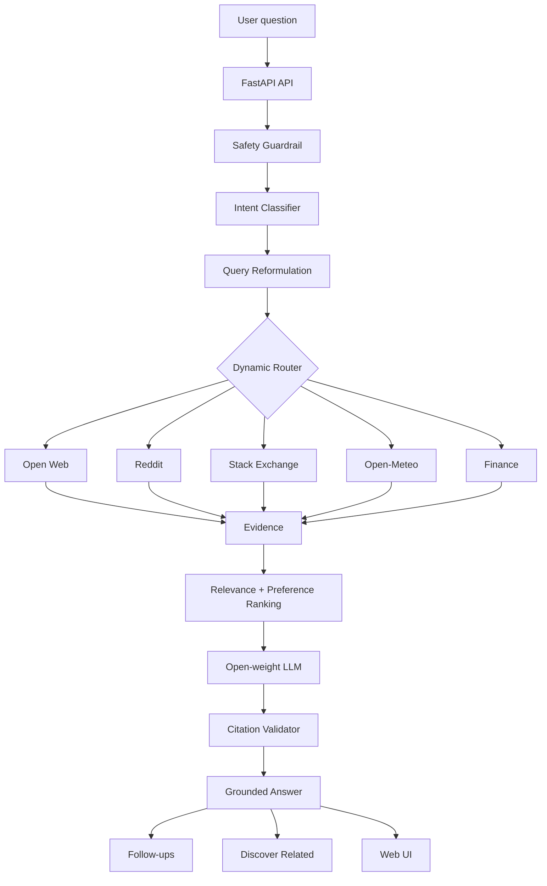

# Universal Grounded Search Agent

A simple, modular AI search assistant that turns one natural-language question into:

**question → safety → intent → query reformulation → source routing → live retrieval → evidence ranking → grounded synthesis → citation check → follow-ups/related discovery**

It is designed to avoid the empty-result problem shown in the earlier UI by using a general web fallback whenever a specialized provider cannot return useful evidence.

## What it supports

- General factual questions and current information → open-web search
- Opinions, reviews and community experience → Reddit
- Programming/developer questions → Stack Exchange
- Weather → Open-Meteo
- Stock/share quotes → Yahoo Finance chart endpoint
- Multi-source retrieval when the router chooses more than one source
- Quick answer / deep dive / tutorial / comparison / summary templates
- Intent classification
- Query reformulation for ambiguous queries
- Source attribution
- Confidence and freshness indicators
- Contextual follow-up questions
- Discover Related suggestions
- Lightweight local interaction-based source ranking
- Prompt-injection resistance
- Citation validation and one repair pass
- In-memory caching
- Optional LangSmith configuration
- Visible activity trace in the UI

## Architecture



## Run locally

### Windows PowerShell

```powershell
cd universal-grounded-search-agent
python -m venv venv
.env\Scripts\Activate.ps1
python -m pip install -r requirements.txt
copy .env.example .env
python -m uvicorn app:app --reload
```

Open:

`http://127.0.0.1:8000`

### Environment

At minimum, set `GROQ_API_KEY` in `.env` for LLM synthesis and richer intent/follow-up generation.

Reddit requires:
- `REDDIT_CLIENT_ID`
- `REDDIT_CLIENT_SECRET`
- `REDDIT_USER_AGENT`

If Reddit credentials are absent, the application still works because general web search remains available.

## Technical design

### 1. Intent classification
The router first uses deterministic high-confidence rules for obvious domains. It then asks the LLM for a structured intent classification when available.

Supported intent labels:
- `quick_answer`
- `deep_dive`
- `tutorial`
- `summary`
- `comparison`
- `exploratory`

### 2. Universal retrieval
Specialized sources are used when they are clearly appropriate. For everything else, web search is the default fallback.

This is important: a question about a laptop, company, product, science topic, travel destination, definition, or general research topic should not become `stackexchange` merely because the system has a technical source.

### 3. Query reformulation
For high ambiguity, the LLM creates up to three search formulations. The system searches each formulation and de-duplicates URLs.

### 4. Grounding
Every evidence item receives a run-local source ID such as `[S1]`. The answer must cite the IDs it uses. Citation validation rejects citations that do not exist in the retrieved evidence.

### 5. Freshness
Each source stores `retrieved_at`. The UI displays `verified just now` for a successful grounded retrieval. The actual source timestamp is also shown in the source list.

### 6. Personalization
The feedback buttons update a tiny local preference model. Positive/negative feedback changes the ranking score for source types. This is intentionally simple and can later be replaced by a database or feature store.

### 7. Prompt-injection defense
Retrieved content is treated as data. It is never inserted as system instructions. Known injection patterns are filtered before evidence is passed to the synthesis model.

### 8. Failure handling
If a specialized provider returns nothing, the agent tries general web search before giving a no-evidence response. If the LLM is unavailable, a conservative evidence-based fallback answer is produced.

## Pseudocode

```text
function SEARCH(question, template):
    if not safe(question):
        return blocked_response()

    intent = classify_intent(question)
    routes = choose_sources(intent, question)

    queries = [question]
    if intent.ambiguity == HIGH:
        queries = reformulate(question)

    evidence = []
    for query in queries:
        for source in routes:
            results = source.search(query)
            evidence += sanitize(results)

    if evidence is empty:
        evidence += web.search(question)

    evidence = deduplicate(evidence)
    evidence = rank_by_relevance_and_user_preference(evidence)
    evidence = assign_source_ids(evidence)

    draft = llm_answer(
        question,
        template,
        evidence,
        "Use only evidence. Cite every factual claim."
    )

    if not citations_are_valid(draft, evidence):
        draft = repair_with_llm(draft, evidence)

    return {
        answer: draft,
        intent: intent,
        route: routes,
        sources: evidence,
        confidence: confidence(evidence, citations),
        freshness: freshness(evidence),
        follow_ups: generate_followups(question, draft),
        related: generate_related(question, evidence)
    }
```

## Extension points

The provider layer is intentionally modular. Add another source by implementing:

```python
def search(query: str) -> list[dict]:
    return [{
        "type": "my_source",
        "title": "...",
        "url": "...",
        "content": "...",
        "retrieved_at": "...",
        "relevance": 0.8,
    }]
```

Then add one route in `services/router.py` and one branch in `services/providers.py`.

## Important production upgrades

For a production deployment, replace:
- DuckDuckGo HTML scraping → licensed search API
- in-memory cache → Redis
- local preference dictionary → PostgreSQL/feature store
- synchronous HTTP → async clients
- simple pattern guardrails → dedicated moderation + policy layer
- heuristic confidence → calibrated evaluation model
- local logs → LangSmith/Langfuse tracing
- source snippets → richer document extraction and reranking

The current version intentionally stays simple enough for an internship assignment while demonstrating the complete architecture.
