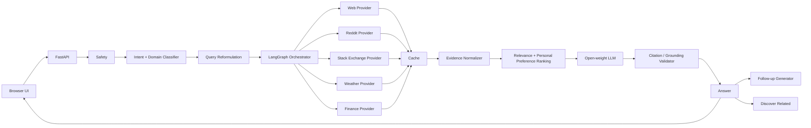

# Component Diagram

## Request lifecycle

1. Browser sends question and selected output template.
2. Safety node blocks credential/system-prompt extraction attempts.
3. Intent classifier predicts answer style and domain.
4. Router selects specialized provider(s) or general web.
5. Reformulator improves ambiguous queries.
6. Providers fetch live evidence.
7. Evidence is sanitized, cached, deduplicated and ranked.
8. Open-weight LLM synthesizes an answer with `[S#]` citations.
9. Citation validator checks that every cited ID exists.
10. A repair pass runs once if citations are invalid.
11. Follow-ups and related discoveries are generated from the grounded result.
12. UI displays answer, activity, sources, confidence and freshness.
